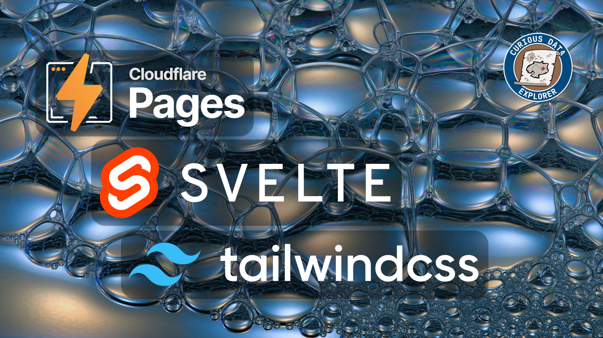

# Cloudflare, SvelteKit and TailwindCSS Project Template and Starter Kit

The project is documented on the [Curious Data Explorer](https://blog.curiodata.pro/posts/07-svelte-cloudflare/) blog.

[](https://blog.curiodata.pro/posts/07-svelte-cloudflare/)

## Setup

There are two approaches to creating a [_Cloudflare_](https://www.cloudflare.com/en-gb/) project that is configured for both [_SvelteKit_](https://kit.svelte.dev) and [_TailwindCSS_](https://tailwindcss.com/).

Option 1: Clone this repository and install the dependencies using the `bun` runtime toolkit.

Option 2: Use your own preferred _Node_ package manager and follow these instructions:

```bash
# Create cloudflare project
npm create cloudflare@latest dummy -- --framework=svelte

# Add TailwindCSS via svelte-add
npx @svelte-add/tailwindcss@latest --typography true
```

## Clone Repository Method

### Dependencies

This repository uses the [`bun`](https://bun.sh/) runtime toolkit.

### Setup

Clone the repository:

```bash
# Clone repository
git clone https://github.com/miah0x41/c3-svelte-tailwind-template.git

# Install dependencies
bun install

bun install v1.1.2 (c8d072c2)

 + @sveltejs/adapter-auto@3.2.2
 + @sveltejs/adapter-cloudflare@4.6.0
 + @sveltejs/kit@2.5.18
 + @sveltejs/vite-plugin-svelte@3.1.1
 + @tailwindcss/typography@0.5.13
 + autoprefixer@10.4.19
 + postcss@8.4.39
 + prettier@3.3.2
 + prettier-plugin-svelte@3.2.5
 + prettier-plugin-tailwindcss@0.6.5
 + svelte@4.2.18
 + tailwindcss@3.4.4
 + vite@5.3.3
 + wrangler@3.63.1

 227 packages installed [4.51s]
```

# License

The project is licensed under the [Apache 2.0](./LICENSE); please note as per the license terms, the project includes a [NOTICE](/NOTICE.md).
